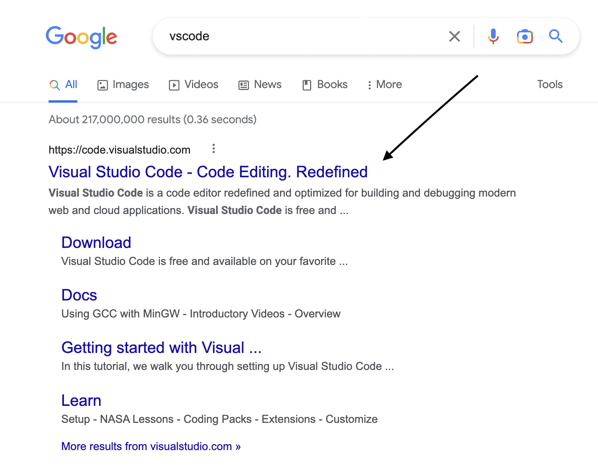
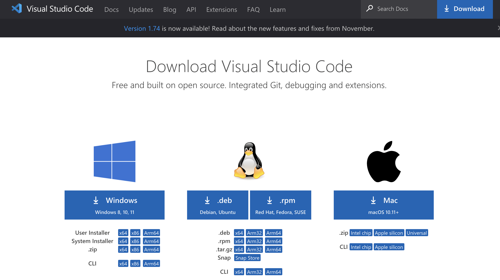
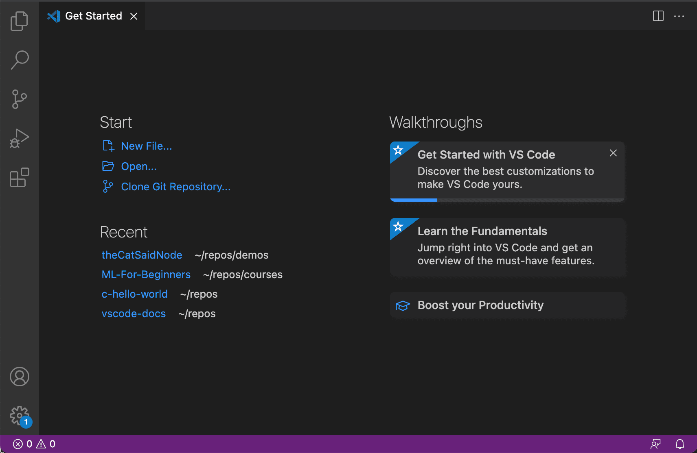
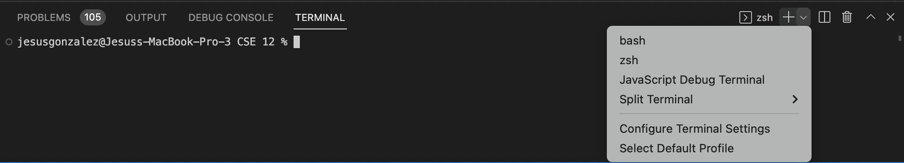
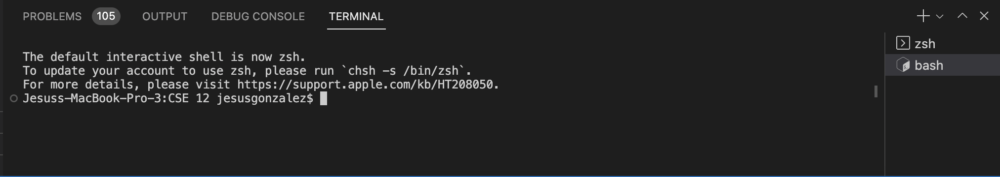
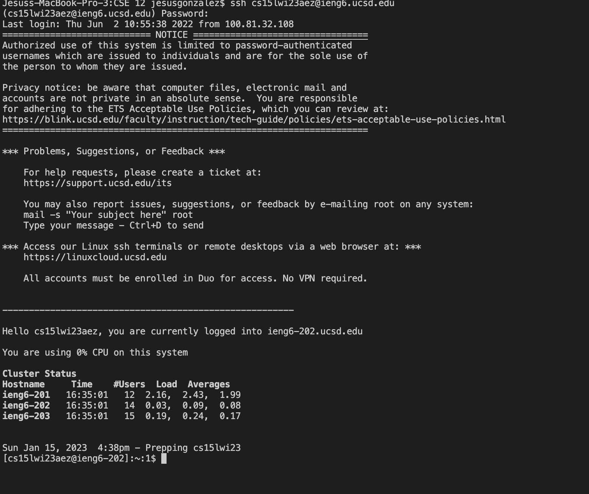
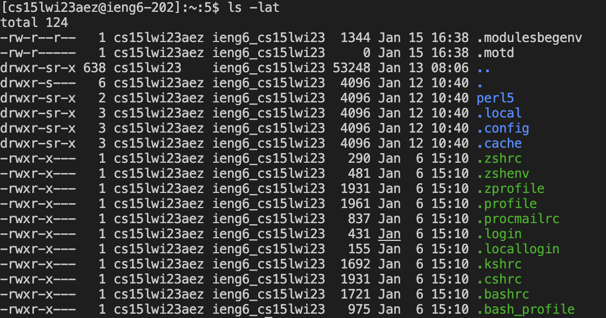
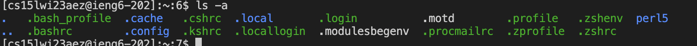
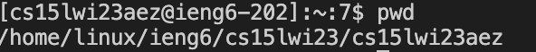
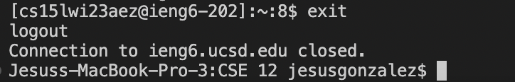

# Lab Report 1
Jesus Gonzalez - CSE 15L - A17425808 - Jan 15, 2023

---
## Installing VScode
1. To install VScode begin by searching VScode in an internet browser.

2. After entering the Vscode website, click the download button in the top right corner. Then Begin installing the VScode software that is apporoate for the device being used

3. Complete VScode set up.

## Remotely Connecting
**This is a tutorial on how to remotely log into a course-specific account on ieng6**
1. In order to begin remotely connect to a server git has to be installed. If on a mac, git does not have to be installed.
[Link](https://gitforwindows.org/)
2. The next step is to open a git. To do this make a new terminal within VS code (Ctrl or Command + `, or use the Terminal → New Terminal menu option). Then open a bash terminal.

3. Once bash is opened it will look like the following

4. Next type in the following, replacing the zz with the letters in your course specific account.
`$ ssh cs15lwi23zz@ieng6.ucsd.edu`
5. You will be prompted with a yes/no question. It is okay to type yes and press enter the first time you log into a server. However if you get a message like this when logging into a server you log into often then that could mean someone may be hacking your server account.
6. Enter your password
7. You are now logged into the server. It will look like the following.

## Trying Some Commands
**Useful Comands**
* pwd (Present working directory)
* cd (Change Directory)
* ls (list directories)
* mkdir (Creates a directory or subdirectory)
* cp (copys files)

